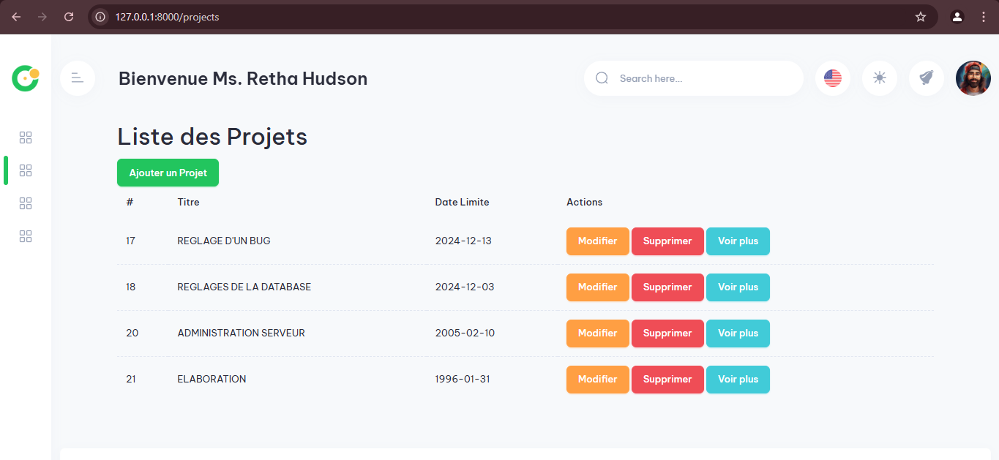
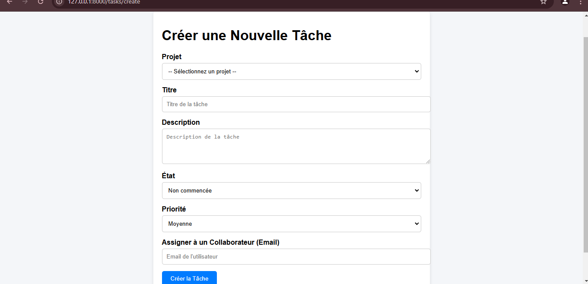

## Aperçu Visuel

### Tableau de Bord


### Gestion des Projets


<<<<<<< HEAD
### Fonctionnalités Principales

1. **Gestion des utilisateurs** :
   - Un utilisateur peut s'inscrire directement via un formulaire d'inscription.
   - Les nouveaux utilisateurs reçoivent par défaut le rôle **"utilisateur simple"**.
   - Pour donner des droits administratifs à un utilisateur, un administrateur existant doit modifier le rôle de l'utilisateur dans la base de données :
     - Accéder à la table **`users`**.
     - Modifier la colonne **`role`** de l'utilisateur cible à **`admin`**.

   ⚠️ Actuellement, l'interface ne permet pas la création directe d'un administrateur. Cette fonctionnalité devait être incluse dans un **seeder** ou un **formulaire spécial**. mais vous pouvez vous en occuper ici.

2. **Gestion des projets** :
   - Un utilisateur connecté peut :
     - Créer de nouveaux projets.
     - Visualiser ses projets, leurs descriptions, et leurs tâches associées.
     - Modifier ou supprimer ses projets.

3. **Gestion des tâches** :
   - Ajout d'une tâche avec la possibilité de l'associer à un projet existant.
   - Assignation des tâches à des utilisateurs via leur email.
   - Notifications par email envoyées automatiquement à l'utilisateur assigné.

4. **Interface dynamique** :
   - Un **dashboard immersif et futuriste** avec animations CSS et intégration de particules.
   - Des statistiques interactives sur les projets et tâches de l'utilisateur connecté.

5. **Visualisation des captures d'écran** :
   - Le dossier **`public/captures`** contient toutes les captures liées au projet.
   - Les images de ce dossier sont affichées dynamiquement dans la section "Aperçu du Projet" de l'interface.

---

### Étapes pour Configurer et Utiliser le Projet

1. **Clonage du projet** :
   - Clonez le projet sur votre machine via Git :
     ```bash
     git clone <url-du-repo>
     cd <nom-du-projet>
     ```

2. **Installation des dépendances** :
   - Installez les packages Laravel nécessaires :
     ```bash
     composer install
     npm install && npm run dev
     ```

3. **Configuration de l'environnement** :
   - Dupliquez le fichier `.env.example` pour créer un fichier `.env` :
     ```bash
     cp .env.example .env
     ```
   - Configurez la base de données dans le fichier `.env` :
     ```env
     DB_CONNECTION=mysql
     DB_HOST=127.0.0.1
     DB_PORT=3306
     DB_DATABASE=workflow
     DB_USERNAME=root
     DB_PASSWORD=
     ```

4. **Génération de la clé de l'application** :
   - Exécutez la commande suivante :
     ```bash
     php artisan key:generate
     ```

5. **Migration de la base de données** :
   - Mettez en place les tables nécessaires :
     ```bash
     php artisan migrate
     ```

6. **Seeder pour utilisateurs et rôles** *(non inclus actuellement)* :
   - Créez un administrateur directement via la base de données ou en adaptant le code.

7. **Lancer le serveur** :
   - Exécutez :
     ```bash
     php artisan serve
     ```

8. **Accéder à l'application** :
   - Rendez-vous sur [http://127.0.0.1:8000](http://127.0.0.1:8000).

---

### Gestion des Captures d'Écran

Pour afficher les **captures d'écran** dans la section d'aperçu :


     ```
## Aperçu Visuel

### Tableau de Bord


### Gestion des Projets


### Gestion des Tâches



---

### Améliorations futures


. **Refonte UI** :
   - Intégration de **chart.js** ou autres bibliothèques pour des graphiques interactifs.
   - Amélioration de la responsivité sur tous les appareils.

. **Intégration API** :
   - Ajouter des points d'accès RESTful pour permettre une gestion à distance.

---

### Notes

Ce projet est conçu pour être extensible et facilement adaptable à d'autres workflows. Toute contribution est bienvenue ! 😊

## Auteurs

<<<<<<< HEAD
- **Nom** - *Développeur principal* - [Rodrigue FAHOUBO](https://github.com/rodrigue-Anonymous)
=======
- **Nom** - *Développeur principal* - [Benisse]()
>>>>>>> 03728dec8ffd89faaa33e31beb499d961dd2dd26

---

### Remarque :

Ce projet est encore en développement. Il est possible que des fonctionnalités supplémentaires soient ajoutées au fil du temps. N'hésitez pas à consulter la documentation Laravel pour plus de détails sur l'utilisation des fonctionnalités du framework.

---

Avec ce **README.md**, tu as un guide complet pour quelqu'un qui souhaite cloner le projet et le faire fonctionner localement. Si tu veux ajouter d'autres détails, n'hésite pas à le faire. 😊
=======
### Gestion des Tâches

>>>>>>> 6bed3c6bdfccde5e315bcdbd1eb6c018e49c2bbd
